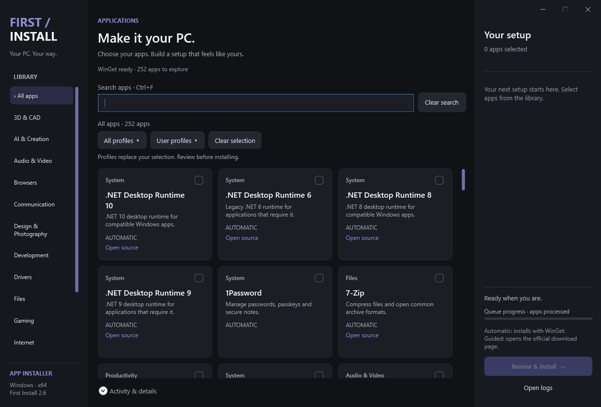

# First Install

**Your PC. Your way.** A Windows desktop app for choosing and installing the software you need after a fresh Windows setup.

Browse 252 applications, start from a ready-made profile, or save your own selection. Review everything before installation begins.

**Version 2.6** · Windows x64 · PowerShell + WPF

[Download FirstInstall.exe](https://github.com/braga1k/First-Install-Script/raw/refs/heads/main/bin/FirstInstall.exe) · [Supported apps](docs/SUPPORTED-APPS.md) · [Profiles](docs/PROFILES.md) · [Report an issue](https://github.com/braga1k/First-Install-Script/issues)



## What it does

- **Browse and search:** filter by category or name in a responsive grid that keeps your selection when the view changes.
- **Install through WinGet:** 233 catalog entries use automatic installation; 19 guided entries open official download pages.
- **Choose a profile:** eight curated setups cover everyday use, gaming, development, creative work and more.
- **Save your own setup:** export your selection to a portable JSON profile and load it again on another PC.
- **Follow your Windows accent:** buttons, selections and scroll handles update to match Windows while the app is open.
- **Review first:** check the installation plan and accept the applicable terms before starting. Required dependencies are added automatically.
- **Track progress:** follow the queue, inspect logs, or stop after the current application finishes.

The catalog prioritizes open-source options where practical and also includes popular proprietary tools. See the catalog for each app's installation method and license label.

## Get started

1. [Download the executable](https://github.com/braga1k/First-Install-Script/raw/refs/heads/main/bin/FirstInstall.exe) and open **FirstInstall.exe**.
2. Select applications, or choose a setup from **All profiles**.
3. Adjust the selection in **Your setup**.
4. Choose **Review & install**, review the plan and accept the terms.
5. Start the queue. Complete any guided installations on the official websites that open.

The executable contains the app's script, interface and catalog. You do not need Python, Zig or a separate source folder to run it. The current binary is unsigned; its SHA-256 checksum is in [bin/SHA256SUMS.txt](bin/SHA256SUMS.txt).

### Requirements

- Windows 10 or Windows 11, **64-bit**. Version 2.6 was tested on Windows 11 24H2.
- Windows PowerShell 5.1, WPF and .NET Framework 4.x.
- WinGet, provided by Windows App Installer, for automatic installations.
- An internet connection to download applications. Individual installers may request administrator access.

Rounded corners depend on Windows 11. If WinGet is missing, the app offers to open the App Installer page.

## Profiles

**All profiles** contains:

| Profile | Intended setup |
| --- | --- |
| Everyday essentials | Browsing, passwords, files and media |
| Creator | Video, recording, image editing and file sharing |
| Gaming | Game library, voice chat and required runtimes |
| Development | Code editor, Git, Python, Node.js and API tools |
| Office & study | Documents, email, notes, research and PDFs |
| Audio production | Recording, editing, mixing and system EQ |
| 3D & printing | Modeling, CAD and 3D printing |
| Open-source essentials | An everyday setup built from open-source apps |

Applying a profile **replaces the current selection**. It does not start installation. Creator and Gaming are available inside this menu, without separate toolbar shortcuts.

### Create your own profile

1. Select the applications you want.
2. Open **User profiles → Save current selection...** and choose a filename.
3. Later, use **User profiles → Load saved profile...** to restore that selection.

Profiles are portable JSON files. They store catalog keys, not installer commands. Empty selections cannot be saved, and invalid files leave the existing selection intact. A profile created by a newer catalog may contain keys that an older app version cannot recognize.

[View every built-in profile and its applications](docs/PROFILES.md).

## Run from source

Download this repository with **Code → Download ZIP**, extract the complete folder, then double-click `script_allower.cmd`.

Alternatively, run this from the repository folder:

```powershell
powershell.exe -NoProfile -STA -ExecutionPolicy Bypass -File .\vexan_installers.ps1
```

The launcher applies the execution-policy option only to that PowerShell process. It does not change your saved execution-policy settings. Keep `catalog.json`, `profiles.json`, `interface.xaml` and `src/` beside the script.

## Build the executable

From the repository folder on Windows:

```powershell
powershell.exe -NoProfile -ExecutionPolicy Bypass -File .\build-windows.ps1
```

The output is `dist/FirstInstall.exe`. The build uses the .NET Framework C# compiler included with Windows; no Visual Studio installation is needed. Rebuild whenever you change the script, catalog, profiles or interface. `build.py` is retained as an alternative Python/Zig build path.

## Validation

Run the source checks:

```powershell
powershell.exe -NoProfile -STA -ExecutionPolicy Bypass -File .\tests\smoke.ps1
```

The executable also accepts `--self-test` and `--smoke-test`; these write their results beside the executable. The tests validate catalog consistency, dependency handling, profile save/load, category and search layout, scrolling, Windows accent updates, contrast and window controls. UI tests briefly open windows and do not install third-party applications.

The bundled 2.6 executable passed both checks on Windows 11. Actual installation of every catalog entry has not been tested. High-contrast mode and large text scaling still need broader validation.

## Troubleshooting

| Problem | What to check |
| --- | --- |
| Automatic installations are unavailable | Install or update Windows App Installer, then reopen First Install. |
| An application fails to install | Open **Activity & details** or **Open logs** and inspect its result. |
| A guided app is not installed automatically | Complete the download and installer on the official page opened by the app. |
| A saved profile cannot load | Use a profile saved by First Install with application keys present in this version. |
| The app cannot start | Check `%TEMP%\FirstInstall-startup-error.log`. |

Installation logs are stored in `%LOCALAPPDATA%\FirstInstall\Logs`. Before sharing logs in an issue, review them for personal paths or other private information.

## Project layout

```text
vexan_installers.ps1   App behavior and installation queue
interface.xaml        WPF layout and styles
catalog.json          Application catalog and dependencies
profiles.json         Built-in profile definitions
build-windows.ps1     Windows executable build
script_allower.cmd    Source launcher
src/                  Executable launchers, window helper and icon
tests/                Catalog and UI smoke checks
bin/                  Ready-to-run executable and checksum
docs/                 Catalog, profiles, coverage and screenshot
```

## Catalog maintenance and contributions

To propose an application, include its official website, WinGet package ID if available, license, and category. Catalog entries must use an exact package ID or an official guided-install URL. Update relevant profiles and run the checks before submitting a change.

For bug reports, include your Windows version, First Install version, steps to reproduce and the relevant log excerpt. Suggestions and pull requests are welcome through [GitHub issues](https://github.com/braga1k/First-Install-Script/issues) and pull requests.

## Credits and licensing

The catalog takes inspiration from [Chris Titus Tech's WinUtil](https://github.com/ChrisTitusTech/winutil). The recorded comparison on 15 September 2026 covered all 233 entries in the checked snapshot; this is a snapshot comparison, not a claim of permanent parity. [Coverage details](docs/WINUTIL-COVERAGE.json).

Automatic installation is powered by [Microsoft WinGet](https://github.com/microsoft/winget-cli). Windows accent integration follows [Microsoft's theming guidance](https://learn.microsoft.com/en-us/windows/apps/develop/ui/theming).

Third-party applications retain their own licenses and may require an account or paid subscription. Inclusion in a profile does not provide a license. This repository does not currently declare a project license.
